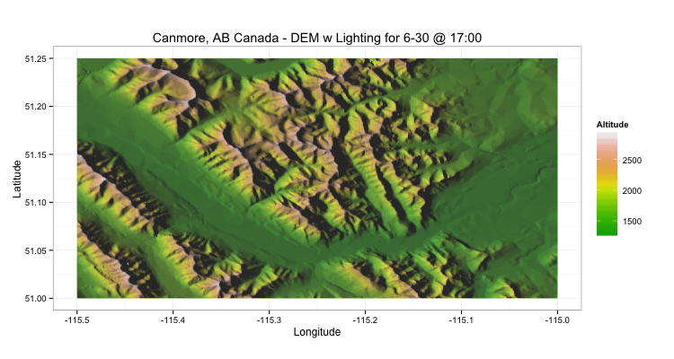

Digital Elevation Model and Hillshade
=============

Canadian Digital Elevation Data - Hillshade Mapping

This analysis shows a simple example of using the NRCAN (free public) data to plot digital elevation mapping, and then uses the current date to plot shade based on the position of the sun.

Here's an example of the output for the Canmore, Alberta area:

### References

1.   [DEM in ggplot2: Stack Overflow](http://stackoverflow.com/questions/11179666/ggplot2-raster-plotting-does-not-work-as-expected-when-setting-alpha-values)
2.   [Position of the Sun: Stack Overflow](http://stackoverflow.com/questions/8708048/position-of-the-sun-given-time-of-day-latitude-and-longitude)